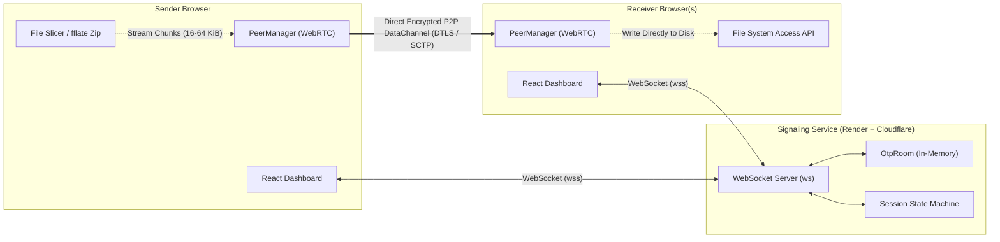

# OnShare

<div align="center">

### High-speed, browser-to-browser P2P file and real-time live text sharing

[](https://onshare.me)
[](https://vitest.dev/)
[](https://onshare.me)
[-orange?style=flat-square&logo=webrtc)](https://webrtc.org/)
[](LICENSE)

**[Experience Live on onshare.me](https://onshare.me)**

</div>

---

## Overview

**OnShare** is a modern, privacy-first peer-to-peer web application that enables instant file transfers and real-time collaborative text editing directly between browsers.

Unlike traditional cloud-based transfer tools, **OnShare never stores your files, names, or text on any server**. All content moves securely over encrypted WebRTC DataChannels directly between connected devices, with zero account registration and zero friction.

---

## Key Features

### Dual Pairing Modes

- **Direct Mode (1-to-1, Reversed OTP)**:
  - The **receiver** generates a 6-digit one-time code; the **sender** enters it to authorize transmission.
  - Guarantees complete sender-side gating—an overheard code cannot be used to pull files without sender approval.
  - Supports up to 10 individually authorized receivers per session.
- **Broadcast Mode (1-to-Many, Forward OTP)**:
  - The **sender** toggles Broadcast Mode and generates a single 6-digit code.
  - Up to **50 concurrent receivers** can enter the code and download simultaneously.
  - One-click code regeneration and automatic code invalidation if the file list changes.

### High Capacity & Zero-Memory Streaming

- **Direct-to-Disk Streaming**: Utilizes the Chromium `File System Access API` (`showSaveFilePicker`) to stream incoming chunks straight to disk, preventing browser memory exhaustion.
- **Up to 35 GB Single File Support**: Handles multi-gigabyte transfers with flat memory consumption.
- **On-the-Fly ZIP Bundling**: Multi-file transfers are automatically streamed and packed into a single zip archive using `fflate` store mode (up to 4 GB combined).

### Live Notepad (Real-Time Text Sync)

- Instant collaborative text scratchpad powered by **Yjs CRDTs**.
- Star topology with conflict-free merges and zero central storage.
- Senders maintain full control with an "Allow Edit" toggle (read-only by default for receivers).
- Live character counter supporting up to 500,000 characters with one-click copy and `.txt` export.

### Global Internationalization (30 Languages)

- Full localized interface available in **30 languages**, including English, Spanish, French, Hindi, Bengali, Marathi, Gujarati, Punjabi, Malayalam, Tamil, Arabic, Chinese, Japanese, German, Russian, and more.
- Native **Right-to-Left (RTL)** layout mirroring for Arabic.

### Non-Intrusive Privacy & Monetization Design

- **100% Privacy by Design**: All transfers are encrypted end-to-end via DTLS and SCTP. WebSockets are used solely for ephemeral peer discovery (SDP/ICE signaling).
- **Zero-Disruption Ad Architecture**: Monetized via Google AdSense with strict user-experience guarantees:
  - **Zero popups, zero vignettes, zero interstitial timers**.
  - Ads are confined to pre-reserved layout slots outside interactive cards (CLS = 0).
  - File transfers and buttons are never blocked or obscured.

---

## System Architecture



---

## Monorepo Structure

```
OnShare/
├── apps/
│   ├── web/                  # Frontend SPA (React 18, Vite, Tailwind CSS, i18next)
│   │   ├── src/
│   │   │   ├── components/   # DashboardSend, DashboardReceive, DashboardText, AdSlot
│   │   │   ├── routes/       # Home, HowItWorks, Privacy, Terms, Contact, Feedback
│   │   │   ├── signaling/    # WebSocket client & reconnect logic
│   │   │   ├── transfer/     # Streaming file reader, zip pipeline & disk sink
│   │   │   ├── webrtc/       # PeerManager, ICE candidates, DataChannel handling
│   │   │   └── text/         # Yjs CRDT real-time text sync hub
│   │   └── public/           # Static assets, favicon, ads.txt
│   └── signaling/            # Coordination backend (Node.js, ws)
│       └── src/
│           ├── server.js     # HTTP static host & WebSocket server
│           ├── session.js    # Session state machine, timer expiry, 10/50 caps
│           ├── otp-room.js   # 6-digit OTP pairing & atomic consumption
│           └── limiter.js    # Brute-force & rate-limiting protection
├── packages/
│   └── protocol/             # Shared runtime validation (Zod schemas, error codes)
└── tests/                    # Playwright E2E suites & Vitest unit/integration tests
```

---

## Getting Started

### Prerequisites

- **Node.js**: `v18.0.0` or higher
- **npm**: `v9.0.0` or higher

### 1. Installation

Clone the repository and install all workspace dependencies:

```bash
git clone https://github.com/PurushottamBarai/OnShare.git
cd OnShare
npm install
```

### 2. Running Locally

You can run both services simultaneously in separate terminal windows:

#### Terminal 1: Start the Signaling Server

```bash
npm run dev:signaling:node
# Runs on http://localhost:8787 (broker for WebSockets & fallback static files)
```

#### Terminal 2: Start the Web Frontend (Vite)

```bash
npm run dev:web
# Accessible at http://localhost:5173
```

---

## Testing & Code Quality

The repository maintains strict test coverage with comprehensive unit, integration, and protocol tests:

```bash
# Run the complete Vitest test suite (47 tests)
npm test

# Run ESLint across all workspaces
npm run lint

# Auto-fix linting issues
npm run lint:fix

# Run Playwright End-to-End tests
npm run test:e2e

# Build all monorepo packages for production
npm run build
```

---

## Security & Abuse Mitigation

| Threat | Mitigation |
| :--- | :--- |
| **Overheard OTP Code** | In Direct Mode, the sender must enter the code; knowledge of an OTP alone is useless to an unauthorized party. |
| **Brute-Force Guessing** | Strict rate-limiting on code entry (max 5 failed attempts per minute triggers escalating lockout). |
| **Silent Data Push** | Receivers must explicitly tap **Accept** after reviewing sender identity, file count, and total payload size. |
| **Man-in-the-Middle** | DataChannels are encrypted point-to-point via DTLS and SCTP. TURN relays only forward opaque ciphertext. |
| **Data Retention** | Ephemeral architecture: zero databases, zero cloud storage, zero persistence of file names or contents. |

---

## Deployment

- **Production URL**: [`https://onshare.me`](https://onshare.me)
- **Edge Routing & SSL**: Cloudflare DNS, CDN caching, and TLS termination.
- **Signaling & Web Service**: Containerized Node.js service on Render (`apps/signaling/src/server.js`).
- **Continuous Deployment**: Automated deployment pipeline triggered upon push to `main`.

---

## License

This project is licensed under the [MIT License](LICENSE).
